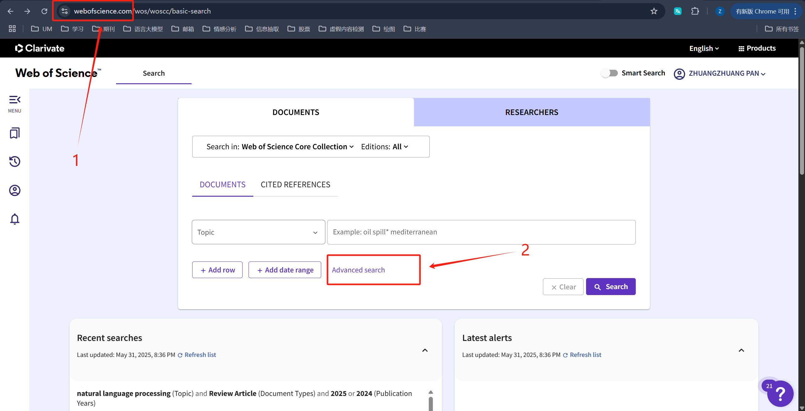
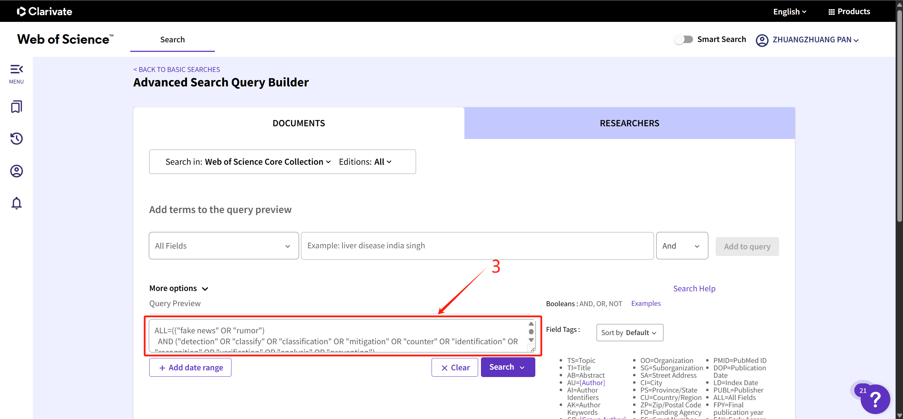

# Web of Science 筛选指南

以下指南旨在帮助学生利用给定的高级检索脚本，在 Web of Science （WoS）平台上进行文献筛选。请按照下述步骤操作，并根据需要对检索式进行微调。

---

## 目录

1. [前提准备](#前提准备)  
2. [访问 Web of Science](#访问-web-of-science)  
3. [切换到高级检索界面](#切换到高级检索界面)  
4. [理解并粘贴检索脚本](#理解并粘贴检索脚本)  
5. [运行检索并查看结果](#运行检索并查看结果)  
6. [根据需求进一步筛选](#根据需求进一步筛选)  
7. [导出与保存检索结果](#导出与保存检索结果)  
8. [常见问题与注意事项](#常见问题与注意事项)  

---

## 前提准备

1. **访问权限**  
   - 确保你所在学校或机构已开通 Web of Science 访问权限。通常需要校园网或 VPN 登录后才能使用全部功能。  
2. **检索脚本概述**  
   - 本次筛选的目标主题为“多模态假新闻（fake news）检测/分类/识别等”，并限定在一系列指定的期刊和会议上发表的文章。  
   - 检索脚本将包含三部分：  
     1. **ALL=**：主题关键词（假新闻、检测/分类/识别等、多模态）  
     2. **IS=**：期刊 ISSN 限定（以 ISSN 号筛选指定期刊）  
     3. **SO=** 或 **CF=**：以期刊全名（Source）或会议全称（Conference）筛选（作为备选，视个人偏好与系统支持而定）  

---

## 访问 Web of Science

1. 打开浏览器，访问 Web of Science 官方主页：  
```html
https://www.webofscience.com
````
2. 如果校园网或机构已授权访问，登录后即可使用。如果提示需要登录，请按照所属机构的认证方式（单点登录 / Shibboleth / VPN）进行登录。

---

## 切换到高级检索界面

1. 在主界面顶部导航栏中，点击 **“高级检索”（Advanced Search）**。  
2. 在高级检索页面，你会看到一个可编辑的文本框，用于输入包含逻辑运算符（AND / OR / NOT）与字段限定的完整检索式。



---

## 理解并粘贴检索脚本

以下为完整的高级检索脚本示例。请复制下列内容并粘贴到“高级检索”文本框中（**务必一次性完整复制, 脚本见最后**）。



### 各部分解释

1. **`ALL=(...)` 部分：主题关键词**

   * `"fake news" OR "rumor"`：搜索文章中包含 “fake news” 或 “rumor” 关键词。
   * `"detection" OR "classify" OR "classification" OR "mitigation" OR "counter" OR "identification" OR "recognition" OR "verification" OR "analysis" OR "prevention"`：定位与“检测/分类/识别/分析/防范”等相关的研究。
   * `"multimodal*" OR "multi-modal*" OR "multimedia" OR "text-image"`：检索与“多模态” 或 “文本-图像多媒体” 相关的研究。
   * 三者以 `AND` 连接，确保检索结果同时满足假新闻主题、相关方法/方向、多模态特征。

2. **`IS=(...)` 部分：期刊 ISSN 号限定**

   * 将一大串目标期刊的 ISSN（国际标准连续出版物号）以 `OR` 方式罗列，确保检索结果仅来自这些期刊。
   * 优点：ISSN 是唯一标识，系统检索时不会因期刊名称拼写差异导致遗漏。
   * 如果不熟悉 ISSN 号，也可忽略此部分，改用 `SO=(期刊全名)` 进行筛选。

3. **`SO=(...)` 部分：期刊全名限定（Source）**

   * 罗列了与计算机科学、模式识别、人工智能、安全、数据库、网络等领域相关的顶级期刊全称。
   * 如果希望通过期刊名称过滤，可直接复制此段。
   * 注意：名称需与 WoS 系统中的期刊名完全匹配，否则检索无效。

4. **`CF=(...)` 部分：会议全名限定（Conference）**

   * 罗列了大量与并行计算、存储系统、硬件架构、网络安全、数据库、机器学习、人工智能等领域相关的国际顶级会议全称。
   * 如果希望检索会议论文（而非仅期刊文章），可使用此部分进行筛选。
   * 同样需要与 WoS 数据库中的会议名称完全一致。

5. **逻辑关系（`AND`、`OR`）**

   * `AND`：交集，表示必须同时满足左右两侧条件。
   * `OR`：并集，表示满足任一选项即可。
   * 小括号`(...)`用于分组，确保检索逻辑符合预期。

---

## 运行检索并查看结果

1. **粘贴检索式**

   * 在高级检索界面的文本框内，将上述完整检索脚本粘贴进去。
   * 检查无多余换行或缺失字符，确保复制黏贴时未出现空格丢失或括号未闭合。

2. **点击“搜索”（Search）按钮**

   * 系统将按照逻辑运算依次过滤，显示满足条件的文献列表。
   * 等待检索完成后，可在下方查看结果统计（例如：共检索到 XX 条记录）。

3. **查看文献列表**

   * 默认结果按“主题相关度”排序（可点击“被引频次”、“出版年”等进行二次排序）。
   * 如果检索结果过多，可结合下述“进一步筛选”方法进行精炼。

---

## 根据需求进一步筛选

1. **按时间范围筛选**

   * 在检索结果页面左侧，“出版年”（Publication Years）栏目中，可直接勾选某一范围（例如：2022–2025）或自定义填写起止年。
   * 若关注最新进展，建议限制为近五年或近三年。

2. **按文献类型筛选**

   * 在左侧“文献类型”（Document Types）筛选中，可选择 “Article” （期刊论文）或 “Proceedings Paper” （会议论文）等。
   * 如果只需要正式发表的论著，可以仅保留 “Article” 项，去除综述、书评、编辑材料等。

3. **按学科领域筛选**

   * 若只关注计算机科学或相关领域，可在“学科领域”（Research Areas）中选择 “Computer Science” 及其子领域，如 “Computer Science, Artificial Intelligence”、“Computer Science, Information Systems” 等。
   * 这样可以剔除一些可能因为关键词匹配但与研究领域不符的文献。

4. **按作者、机构、国家/地区筛选（可选）**

   * 若有特定研究机构或专家组关注，可以在“作者”（Authors）、“机构”（Organizations）或“国家/地区”（Countries/Territories）中进一步聚焦。

5. **按引用次数 / 被引频次排序**

   * 如果想找已经产生较大影响的经典文献，可以在排序中选择 “被引频次”（Times Cited – highest to lowest）。
   * 若想关注最新但还未被大量引用的研究，可选择 “发布日期” 或 “相关度” 排序。

---

## 导出与保存检索结果

1. **选择要导出的记录**

   * 默认情况下，页面会显示每页 10 或 25 条记录，可在页面右上方调整每页条数（最多可显示 50 条/页）。
   * 如果想导出所有结果，可勾选“选择所有 XX 条记录”（Select all).

2. **点击“导出”按钮（Export）**

   * 在检索结果列表的上方或下方，点击 **“导出”**/“导出到文件”（Export to Files）链接。
   * 弹出导出选项对话框，选择导出格式：

     * **“Excel”（\*.xlsx）**：方便后续数据分析。
     * **“Plain Text”（\*.txt）或 “Tab-delimited (Win)”**：适用于用其他软件处理。
     * **“EndNote/RefMan/BibTeX”**：适用于参考文献管理工具。

3. **选择导出字段**

   * 常见导出字段包括：**作者（Authors）、标题（Title）、来源（Source）、出版年（Publication Year）、DOI、被引次数（Times Cited）、摘要（Abstract）** 等。
   * 如果只需要基本信息，可以仅勾选 **“Author, Title, Source, Year, DOI”**。

4. **点击“导出”并下载**

   * 确认导出格式和字段后，点击“导出”按钮。
   * 系统会生成文件并弹出下载对话框，保存到本地即可。

---

## 常见问题与注意事项

1. **检索式长度和系统限制**

   * Web of Science 高级检索对检索式长度和复杂度有一定限制。如果检索式过长导致报错，可考虑拆分为两步：

     1. 先进行主题（ALL=）与期刊/会议（SO= 或 CF=）的检索，导出结果为临时列表。
     2. 在“编辑检索（Refine）”界面，将结果与多模态关键词（“multimodal\*” 等）进行交集检索。

2. **关键词同义/变体处理**

   * `"multimodal*"` 可匹配 “multimodal”, “multimodality” 等词。
   * `"multi-modal*"` 用于覆盖带连字符的写法。
   * 如果后续研究中出现新的术语（例如 “cross-modal”），可根据需要在关键词中补充。

3. **期刊/会议名称易错问题**

   * 若使用 `SO=` 或 `CF=` 限定，请务必与 WoS 数据库中的官方名称一致。可以先在 WoS 中搜索单个期刊/会议名称，确认拼写。
   * 若在 `IS=` 部分使用 ISSN，系统会自动识别，无需担心名称差异。

4. **检索结果过大或过小**

   * 如果检索结果过大（如数万条），可结合“出版年”、“学科领域”等二次筛选。
   * 如果检索结果过少（如不足十几条），可适当放宽某些限制，如删去部分期刊/会议筛选条件，或减少关键词限制。

5. **定期更新检索策略**

   * 研究领域变化较快，新的期刊/会议不断出现。建议每学期或每半年更新一次检索策略：

     * 关注新增的高影响力期刊/会议。
     * 根据最新研究热点（如“跨模态预训练”）增补关键词。

---

## 约束影响因子10以上和CCF A

```shell
ALL=(("fake news" OR "rumor")
  AND ("detection" OR "classify" OR "classification" OR "mitigation" OR "counter" OR "identification" OR "recognition" OR "verification" OR "analysis" OR "prevention")
  AND ("multimodal*" OR "multi-modal*" OR "multimedia" OR "text-image"))
AND (
IS=(1553-877X OR 0018-9219 OR 2522-5839 OR 0360-0300 OR 1566-2535 OR 1574-0137 OR 2307-387X OR 2470-9476 OR 0733-8716 OR 0162-8828 OR 2573-5144 OR 2168-2267 OR 1536-1284 OR 1551-3203 OR 0736-5845 OR 2162-237X OR 2329-9266 OR 2467-964X OR 0278-3649 OR 1089-778X OR 1057-7149 OR 2096-0654 OR 1063-6706 OR 0166-3615 OR 1536-1276 OR 2168-2216 OR 2327-4662 OR 2210-6502 OR 1568-4946 OR 2332-7731 OR 1552-3098 OR 0950-7051 OR 0167-9236 OR 0031-3203 OR 1556-6013 OR 0730-0301 OR 0020-0255 OR 0893-6080 OR 0957-4174 OR 1007-0214 OR 1520-9210 OR 0018-9286 OR 1077-2626 OR 0018-926X OR 0098-5589 OR 0018-9316 OR 1559-8985 OR 1554-0669 OR 0920-5691 OR 1942-4787 OR 0269-2821 OR 1084-8045 OR 0890-8044 OR 0167-739X OR 0163-6804 OR 1367-5788 OR 2196-1115 OR 0090-6778 OR 0891-2017 OR 1530-9312 OR 2169-5172 OR 1949-3045 OR 1556-4959 OR 1556-603X OR 1556-6072 OR 0925-2312 OR 2192-1962 OR 0018-9545 OR 1536-1233 OR 2468-5925 OR 2214-2096 OR 1674-733X OR 2327-4697 OR 1545-5955 OR 0167-4048 OR 0018-9529 OR 2168-6750 OR 0920-5489 OR 1041-4347 OR 0019-0578 OR 1939-1374 OR 1071-5819 OR 1568-4539 OR 0129-0657 OR 0884-8173 OR 2329-9290 OR 1545-5971 OR 0004-3702 OR 2468-6557 OR 1045-9219 OR 2214-2126 OR 1389-1286 OR 1548-7660 OR 1063-6536 OR 0005-1098 OR 1319-1578 OR 2364-1185 OR 2329-924X OR 1069-2509 OR 1875-4791 OR 1569-190X OR 0952-1976 OR 2199-4536 OR 2377-3766 OR 1046-8188 OR 2168-7161 OR 1943-0620 OR 2473-2400 OR 1932-4537 OR 0967-0661 OR 0950-5849 OR 0921-8890 OR 1383-7621 OR 1570-7873 OR 0164-1212 OR 1073-0516 OR 1382-3256 OR 1751-570X OR 2333-9403 OR 1536-1225 OR 0018-9251 OR 0098-3063 OR 0018-9340 OR 0924-669X OR 1063-6560 OR 1049-331X OR 2096-0433 OR 0001-0782 OR 1541-1672 OR 0924-6495 OR 0167-8655 OR 2332-7790 OR 0885-2308 OR 1110-8665 OR 2210-5379 OR 1384-5810 OR 2471-285X OR 1533-5399 OR 0743-7315 OR 2405-9595)
OR SO=("ACM Transactions on Computer Systems" OR "ACM Transactions on Storage" OR "IEEE Transactions on Computer-Aided Design of Integrated Circuits and System" OR "IEEE Transactions on Computers" OR "IEEE Transactions on Parallel and Distributed Systems" OR "ACM Transactions on Architecture and Code Optimization" OR "IEEE Journal of Selected Areas in Communications" OR "IEEE Transactions on Mobile Computing" OR "IEEE/ACM Transactions on Networking" OR "IEEE Transactions on Dependable and Secure Computing" OR "IEEE Transactions on Information Forensics and Security" OR "Journal of Cryptology" OR "ACM Transactions on Programming Languages & Systems" OR "ACM Transactions on Software Engineering and Methodology" OR "IEEE Transactions on Software Engineering" OR "IEEE Transactions on Service Computing" OR "ACM Transactions on Database Systems" OR "ACM Transactions on Information Systems" OR "IEEE Transactions on Knowledge and Data Engineering" OR "The VLDB Journal" OR "IEEE Transactions on Information Theory" OR "Information and Computation" OR "SIAM Journal on Computing" OR "ACM Transactions on Graphics" OR "IEEE Transactions on Image Processing" OR "IEEE Transactions on Visualization and Computer Graphics" OR "Artificial Intelligence" OR "IEEE Trans on Pattern Analysis and Machine Intelligence" OR "International Journal of Computer Vision" OR "Journal of Machine Learning Research" OR "ACM Transactions on Computer-Human Interaction" OR "International Journal of Human Computer Studies" OR "Journal of the ACM" OR "Proceedings of the IEEE" OR "Science China Information Sciences")
OR CF=("ACM SIGPLAN Symposium on Principles & Practice of Parallel Programming" OR "Conference on File and Storage Technologies" OR "Design Automation Conference" OR "High Performance Computer Architecture" OR "IEEE/ACM International Symposium on Microarchitecture" OR "International Conference for High Performance Computing, Networking, Storage, and Analysis" OR "International Conference on Architectural Support for Programming Languages and Operating Systems" OR "International Symposium on Computer Architecture" OR "USENIX Annual Technical Conference" OR "European Conference on Computer Systems" OR "ACM Symposium on Cloud Computing" OR "ACM Symposium on Parallelism in Algorithms and Architectures" OR "ACM Symposium on Principles of Distributed Computing" OR "ACM/SIGDA International Symposium on Field-Programmable Gate Arrays" OR "Code Generation and Optimization" OR "Design, Automation & Test in Europe" OR "Hot Chips: A Symposium on High Performance Chips" OR "IEEE International Conference on Cluster Computing" OR "International Conference on Computer Design" OR "International Conference on Computer-Aided Design" OR "International Conference on Distributed Computing Systems" OR "International Conference on Hardware/Software Co-design and System Synthesis" OR "International Conference on High Performance and Embedded Architectures and Compilers" OR "International Conference on Measurement and Modeling of Computer Systems" OR "International Conference on Parallel Architectures and Compilation Techniques" OR "International Conference on Parallel Processing" OR "International Conference on Supercomputing" OR "International Conference on Virtual Execution Environments" OR "International Parallel & Distributed Processing Symposium" OR "International Symposium on Computer Performance Modeling, Measurements and Evaluation" OR "International Symposium on High Performance Distributed Computing" OR "International Test Conference" OR "Large Installation System Administration Conference" OR "Mass Storage Systems and Technologies" OR "Real-Time and Embedded Technology and Applications Symposium" OR "European Conference on Parallel and Distributed Computing" OR "ACM International Conference on Applications, Technologies, Architectures, and Protocols for Computer Communication" OR "ACM International Conference on Mobile Computing and Networking" OR "IEEE International Conference on Computer Communications" OR "Symposium on Network System Design and Implementation" OR "ACM Conference on Embedded Networked Sensor Systems" OR "ACM International Conference on Emerging Networking Experiments and Technologies" OR "IEEE Communications Society Conference on Sensor and Ad Hoc Communications and Networks" OR "International Conference on Information Processing in Sensor Networks" OR "International Conference on Mobile Systems, Applications, and Services" OR "International Conference on Network Protocols" OR "International Symposium on Mobile Ad Hoc Networking and Computing" OR "International Workshop on Network and Operating System Support for Digital Audio and Video" OR "International Workshop on Quality of Service" OR "Internet Measurement Conference" OR "ACM Conference on Computer and Communications Security" OR "European Cryptology Conference" OR "IEEE Symposium on Security and Privacy" OR "International Cryptology Conference" OR "Usenix Security Symposium" OR "ISOC Network and Distributed System Security Symposium" OR "Annual Computer Security Applications Conference" OR "Annual International Conference on the Theory and Application of Cryptology and Information Security" OR "European Symposium on Research in Computer Security" OR "Fast Software Encryption" OR "IEEE Computer Security Foundations Workshop" OR "IEEE International Symposium on Reliable Distributed Systems" OR "International Conference on Cryptographic Hardware and Embedded Systems" OR "International Conference on Dependable Systems and Networks" OR "International Symposium on Recent Advances in Intrusion Detection" OR "International Workshop on Practice and Theory in Public Key Cryptography" OR "Theory of Cryptography Conference" OR "ACM SIGPLAN Conference on Programming Language Design & Implementation" OR "ACM SIGPLAN-SIGACT Symposium on Principles of Programming Languages" OR "ACM International Conference on the Foundations of Software Engineering" OR "ACM Symposium on Operating Systems Principles" OR "Conference on Object-Oriented Programming Systems, Languages, and Applications" OR "International Conference on Automated Software Engineering" OR "International Conference on Software Engineering" OR "International Symposium on Software Testing and Analysis" OR "USENIX Symposium on Operating Systems Design and Implementations" OR "International Symposium on Formal Methods" OR "European Conference on Object-Oriented Programming" OR "European Joint Conferences on Theory and Practice of Software" OR "IEEE International Conference on Program Comprehension" OR "IEEE International Requirements Engineering Conference" OR "International Conference on Advanced Information Systems Engineering" OR "International Conference on Functional Programming" OR "International Conference on Languages, Compilers and Tools for Embedded Systems" OR "International Conference on Model Driven Engineering Languages and Systems" OR "International Conference on Principles and Practice of Constraint Programming" OR "International Conference on Service Oriented Computing" OR "International Conference on Software Analysis, Evolution, and Reengineering" OR "International Conference on Software Maintenance and Evolution" OR "International Conference on Verification, Model Checking, and Abstract Interpretation" OR "International Conference on Web Services (Research Track)" OR "International Middleware Conference" OR "International Static Analysis Symposium" OR "International Symposium on Empirical Software Engineering and Measurement" OR "International Symposium on Software Reliability Engineering" OR "USENIX Workshop on Hot Topics in Operating Systems" OR "ACM Conference on Management of Data" OR "ACM Knowledge Discovery and Data Mining" OR "IEEE International Conference on Data Engineering" OR "International Conference on Research on Development in Information Retrieval" OR "International Conference on Very Large Data Bases" OR "ACM International Conference on Information and Knowledge Management" OR "ACM International Conference on Web Search and Data Mining" OR "ACM Symposium on Principles of Database Systems" OR "Database Systems for Advanced Applications" OR "European Conference on Machine Learning and Principles and Practice of Knowledge Discovery in Databases" OR "IEEE International Semantic Web Conference" OR "International Conference on Data Mining" OR "International Conference on Database Theory" OR "International Conference on Extending DB Technology" OR "International Conference on Innovative Data Systems Research" OR "SIAM International Conference on Data Mining" OR "ACM Conference on Recommender Systems" OR "ACM Symposium on the Theory of Computing" OR "ACM-SIAM Symposium on Discrete Algorithms" OR "Computer Aided Verification" OR "IEEE Annual Symposium on Foundations of Computer Science" OR "IEEE Symposium on Logic in Computer Science" OR "ACM Symposium on Computational Geometry" OR "European Symposium on Algorithms" OR "IEEE Conference on Computational Complexity" OR "International Colloquium on Automata, Languages and Programming" OR "International Conference on Automated Deduction/International Joint Conference on Automated Reasoning" OR "International Conference on Concurrency Theory" OR "International Conference on Hybrid Systems: Computation and Control" OR "Theory and Applications of Satisfiability Testing" OR "International Computing and Combinatorics Conference" OR "ACM International Conference on Multimedia" OR "ACM SIGGRAPH Annual Conference" OR "IEEE Virtual Reality" OR "IEEE Visualization Conference" OR "ACM SIGMM International Conference on Multimedia Retrieval" OR "ACM Symposium on Interactive 3D Graphics" OR "ACM/Eurographics Symposium on Computer Animation" OR "Data Compression Conference" OR "Eurographics" OR "Eurographics Conference on Visualization" OR "Eurographics Symposium on Geometry Processing" OR "Eurographics Symposium on Rendering" OR "IEEE International Conference on Acoustics, Speech and Signal Processing" OR "IEEE International Conference on Multimedia & Expo" OR "International Symposium on Mixed and Augmented Reality" OR "Pacific Graphics: The Pacific Conference on Computer Graphics and Applications" OR "Symposium on Solid and Physical Modeling" OR "AAAI Conference on Artificial Intelligence" OR "Annual Conference on Neural Information Processing Systems" OR "Annual Meeting of the Association for Computational Linguistics" OR "IEEE Conference on Computer Vision and Pattern Recognition" OR "International Conference on Computer Vision" OR "International Conference on Machine Learning" OR "International Joint Conference on Artificial Intelligence" OR "Annual Conference on Computational Learning Theory" OR "Conference on Empirical Methods in Natural Language Processing" OR "European Conference on Artificial Intelligence" OR "European Conference on Computer Vision" OR "IEEE International Conference on Robotics and Automation" OR "International Conference on Automated Planning and Scheduling" OR "International Conference on Case-Based Reasoning and Development" OR "International Conference on Computational Linguistics" OR "International Conference on Principles of Knowledge Representation and Reasoning" OR "International Conference on Uncertainty in Artificial Intelligence" OR "International Joint Conference on Autonomous Agents and Multi-agent Systems" OR "Parallel Problem Solving from Nature" OR "The Annual Conference of the North American Chapter of the Association for Computational Linguistics" OR "ACM Conference on Computer Supported Cooperative Work and Social Computing" OR "ACM Conference on Human Factors in Computing Systems" OR "ACM International Conference on Ubiquitous Computing" OR "ACM Symposium on User Interface Software and Technology" OR "ACM Conference on Supporting Group Work" OR "ACM International Conference on Intelligent User Interfaces" OR "ACM International Conference on Interactive Surfaces and Spaces" OR "European Conference on Computer Supported Cooperative Work" OR "IEEE International Conference on Pervasive Computing and Communications" OR "International Conference on Human Computer Interaction with Mobile Devices and Services" OR "The International AAAI Conference on Web and Social Media" OR "International World Wide Web Conferences" OR "Real-Time Systems Symposium" OR "Conference on Web and Internet Economics" OR "Cognitive Science Society Annual Conference" OR "IEEE International Conference on Bioinformatics and Biomedicine" OR "International Conference on Embedded Software" OR "International Conference on Intelligent Systems for Molecular Biology" OR "International Conference on Research in Computational Molecular Biology" OR "International Conference on Medical Image Computing and Computer-Assisted Intervention")
```

---


## 总结

* 本指南介绍了如何在 Web of Science 平台上，通过 **ALL=、IS=、SO=、CF=** 等字段，结合布尔逻辑对“多模态假新闻”领域的文献进行精准筛选。
* 建议在操作过程中，先熟悉 WoS 的高级检索语法，再将检索式完整粘贴运行，最后结合左侧筛选面板进行精炼。
* 如遇检索结果不理想，可根据实际需求灵活调整关键词、期刊/会议名单或筛选条件。

祝学习顺利，科研进展顺利！